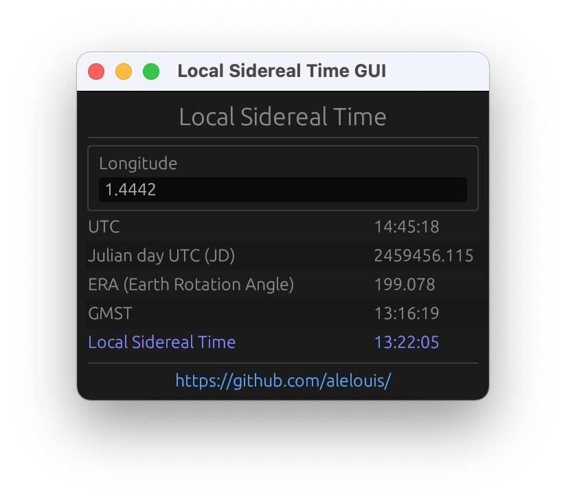

# Local Sidereal Time

Small utility app written in Rust computing your **LST** *(Local Sidereal Time)* at your longitude.  
**LST** is based on Earth's rotation with respect to the stars and not the sun *(hence a faster running clock)*.

  

## Algorithm
- Get **UTC** time
- Compute Julian **UTC** Date (should be **UT1**)
- Compute **ERA** from **JD**
- Compute **GMST** from **ERA** (not really*)
- Compte **LST** from **GMST** and local longitude  

Main steps are implemented under `src/app/lst.rs`.

## Todo
- [ ] Use UT1 instead of UTC for JD
- [ ] *Compensate GMST for precession and nutation  

## References
- https://en.wikipedia.org/wiki/Universal_Time
- http://www.jgiesen.de/astro/astroJS/siderealClock/
- https://en.wikipedia.org/wiki/Sidereal_time#ERA

## Dependencies
`rust` 
`egui` 
`chrono` 
`hifitime`